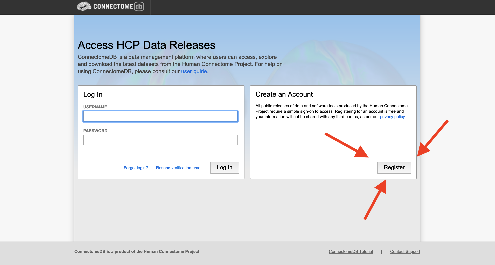
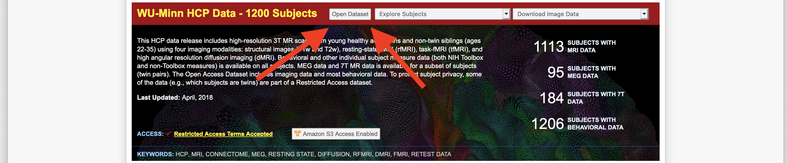
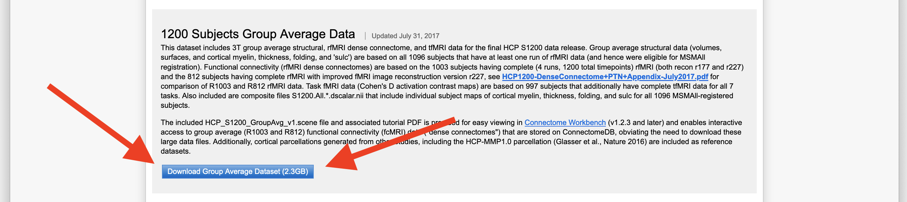

# Downloading data from HCP

In order to fully replicate our analyses you will need access to the [Human Connectome Project](https://www.humanconnectome.org/) (HCP).
Thankfully, getting access is a relatively straightforward process!

## Register on ConnectomeDB

First, navigate to [ConnectomeDB](https://db.humanconnectome.org/), select "Register", and fill out the relevant information (i.e., name, e-mail, and, for whatever reason, institution).

## The S1200 data release

Once you've got your credentials sorted and are able to log in, do so!
You'll want to open the dataset for the S1200 release, which you should see immediately after logging in:

Once you've opened the dataset, scroll down until you see the "1200 Subjects Group Average Data" and click the download button:

(You may have to go through some annoying steps to set up "AsperaConnect" in order to download the files.
I've been assured this provides significant speed-ups for downloading HCP data but it does prove to be an annoying process the first time around.)

## Grab the `MyelinMap` file

Once the file has downloaded, unzip it and copy the file `S1200.MyelinMap_BC_MSMAll.32k_fs_LR.dscalar.nii` into the `data/raw/hcp` directory in the `markello_spatialnulls` repository you cloned to your local computer.
(You may need to create this directory if it does not already exist in the cloned repository!)

Congratulations!
All data fetching, processing, and analysis from this point on can (hypothetically) be done programatically! 🙌
